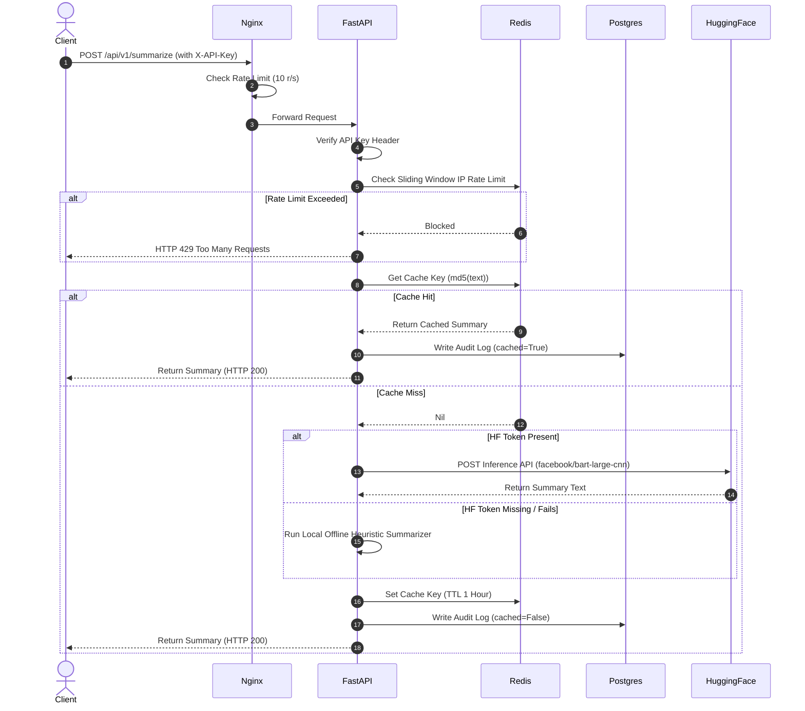

# System Architecture & Data Flow

This document details the micro-container architecture and runtime data flows for the AI Gateway API.

## Architecture Overview

The system is deployed as four isolated containerized services connected via a private Docker bridge network (`api_network`). Only Nginx is exposed to the public internet.

```mermaid
graph TD
    Client[Client / Web Browser] -->|Port 80/443 (HTTPS)| Nginx[Nginx Proxy Container]
    
    subgraph Docker Network [Private api_network]
        Nginx -->|Port 8000 (HTTP)| FastAPI[FastAPI App Container]
        FastAPI -->|Cache Read/Write| Redis[Redis Container]
        FastAPI -->|Log Write| Postgres[(PostgreSQL Container)]
    end
    
    FastAPI -->|HTTPS Request (Cache Miss)| HF[Hugging Face Inference API]
```

### Components

1. **Client**: Connects over HTTPS. Inbound HTTP traffic on Port 80 is redirected to HTTPS (Port 443).
2. **Nginx Reverse Proxy**:
   - Acts as the gateway and SSL termination point.
   - Applies security headers and rate limits request rates per client IP (`10 reqs/sec` baseline, `20 reqs` burst).
   - Resolves Let's Encrypt SSL HTTP-01 challenges under `/.well-known/acme-challenge/`.
3. **FastAPI Application**:
   - Powers the core logic (routing, API-key authentication, caching checks, model execution, audit logging).
   - Implements local CPU-based/heuristic fallback if external LLM providers are unavailable.
   - Runs as a restricted system user (`appuser` UID 1001).
4. **Redis Cache (Port 6379)**:
   - Performs sliding-window rate limiting on incoming API keys/IPs.
   - Caches text summaries (MD5 hash of prompt -> generated summary) to prevent slow external API requests and reduce token costs.
5. **PostgreSQL Database (Port 5432)**:
   - Stores persistent audit logs (`RequestLog`) for reporting and usage metrics.
   - Initialized automatically via SQLAlchemy database schema generation on service boot.

---

## Detailed Data Flow (Summarize Endpoint)

The sequence diagram below visualizes what happens when a client submits text to the `/api/v1/summarize` endpoint:


